# Lightsaber Referee App (Android)

Application Android développée en Kotlin pour l’arbitrage de combats en temps réel.

Projet réel utilisé en club (code privé)

---

## Contexte

Application développée pour répondre à un besoin réel d’arbitrage en club, avec des contraintes de rapidité, lisibilité et fiabilité en situation de combat.

## Fonctionnalités

- Gestion des combats (rounds, score)
- Attribution de points (+1, +2, -1, -2)
- Gestion des pénalités (cartons jaunes / rouges)
- Détection automatique du gagnant
- Gestion des égalités
- Timer configurable

---

## Aperçu

### Combat en cours
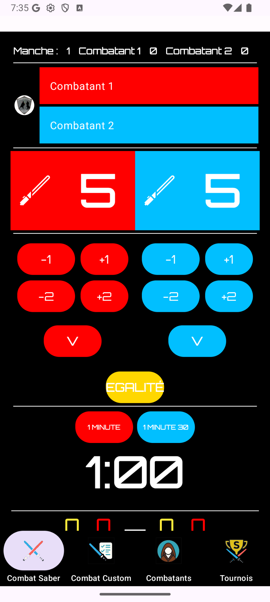

### Utilisation en combat réel
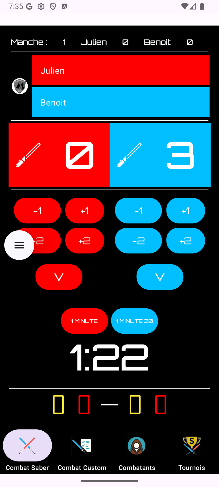

### Gestion des erreurs / état
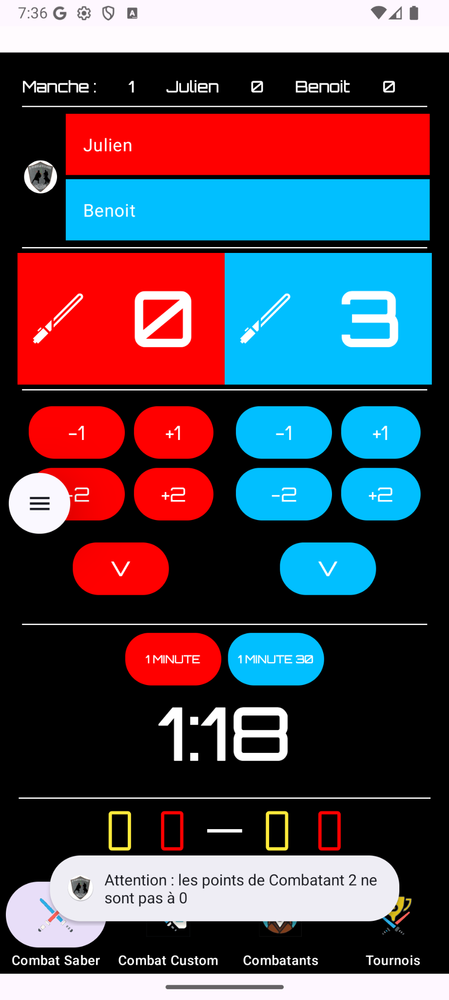

### Attribution de pénalité
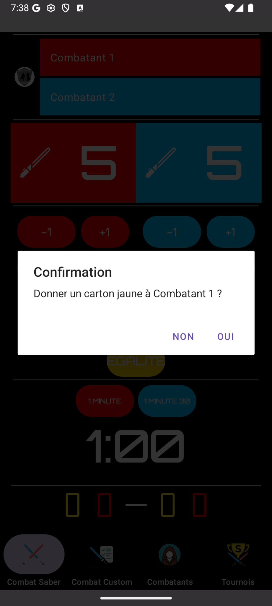

### Écran carton jaune
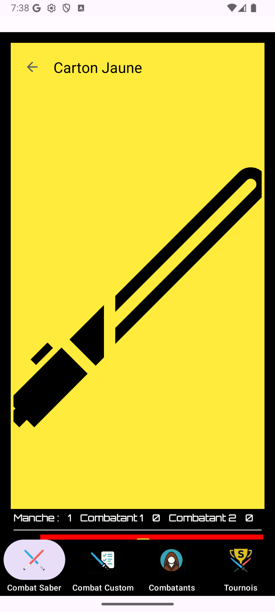

### Gestion égalité
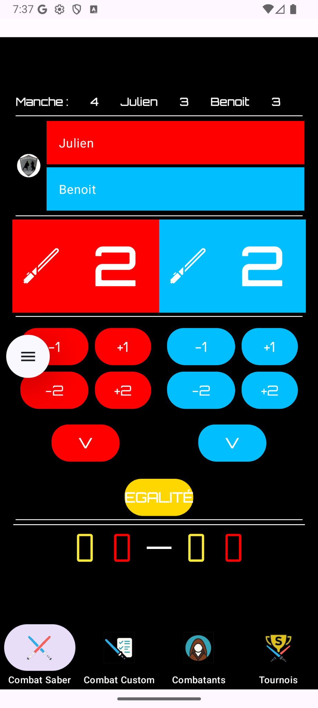

### Fin de combat
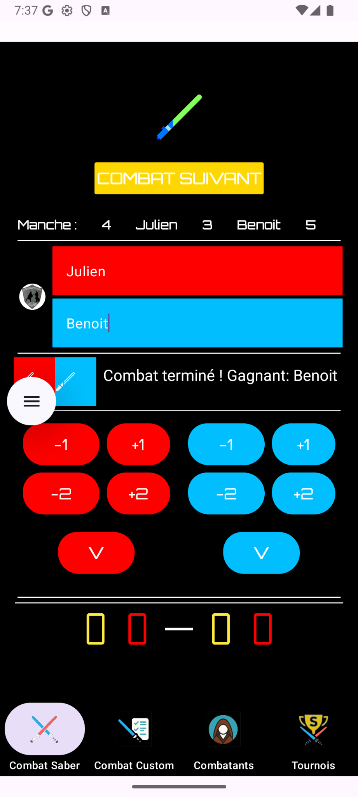

---

## Architecture

Application structurée selon les principes de Clean Architecture avec séparation des responsabilités.

- Data layer : Room (DAO, Database), repositories avec interfaces  
- Domain layer : modèles métier + use cases découplés  
- UI layer : ViewModel, UI State, Jetpack Compose  
- Injection de dépendances avec Hilt  
- Organisation des use cases via des containers pour simplifier l’injection et structurer la logique métier  

Logique métier encapsulée (gestion des combats, scores, statistiques)  
Séparation stricte des responsabilités pour garantir testabilité et maintenabilité  

---

### Data Layer
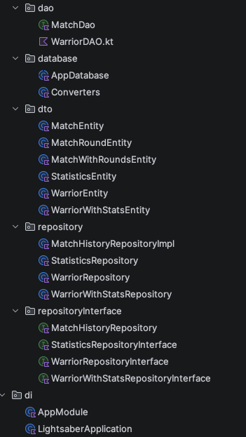

- Room (DAO, Database)
- Repositories avec interfaces

---

### Domain Layer
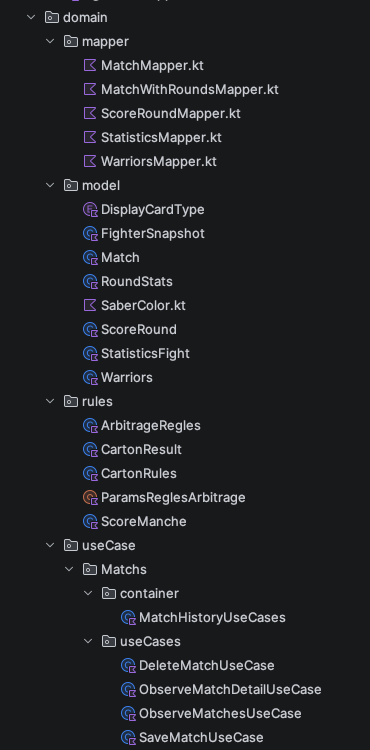

- Modèles métier (Warrior, Statistics)
- Use cases organisés par domaine
- Containers de use cases (WarriorUseCases, StatisticsUseCases)

---

### UI Layer
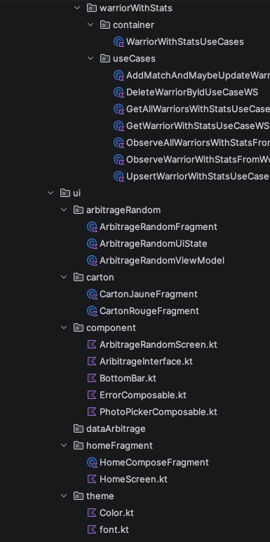

- ViewModel et UI State
- Jetpack Compose
- Composants UI réutilisables

---

### Core / Utils
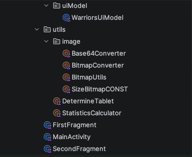

- Conversion Bitmap ↔ Base64
- Détection device (tablet / mobile)
- Logique partagée (calculs statistiques)

---

## Points techniques

- Application conçue pour un usage réel
- Gestion d’état complexe en temps réel
- Composants UI dynamiques
- Encapsulation de la logique métier
- Architecture modulaire facilitant la maintenabilité

---

## Évolution

Application initialement développée en XML puis migrée vers Jetpack Compose.

---

## Note

Le code source complet n’est pas public car utilisé dans un cadre réel.

Ce dépôt présente l’architecture et les fonctionnalités développées.
