# Lightsaber Referee App (Android)

Application Android développée en Kotlin pour l’arbitrage de combats en temps réel.

Projet réel utilisé en club (code privé)

---

## Contexte

Application développée pour répondre à un besoin réel d’arbitrage en club, avec des contraintes de rapidité, lisibilité et fiabilité en situation de combat.

## Fonctionnalités principales

- Création et gestion de combattants
- Sélection des combattants avant combat
- Gestion des manches
- Score en temps réel
- Attribution de points : +1, +2, -1, -2
- Timer configurable : 1 minute / 1 minute 30
- Gestion des égalités
- Gestion des pénalités par cartons
- Sauvegarde de l’historique des combats
- Détail d’un combat terminé
- Statistiques par combattant :
  - combats
  - victoires
  - défaites
  - égalités
  - points donnés
  - points reçus
  - manches gagnées / perdues / égalité
  - ratios
- Favoris

---

## Stack technique

- Kotlin
- Jetpack Compose
- Clean Architecture
- Room
- Hilt

## Aperçu

### Arbitrage — début de combat
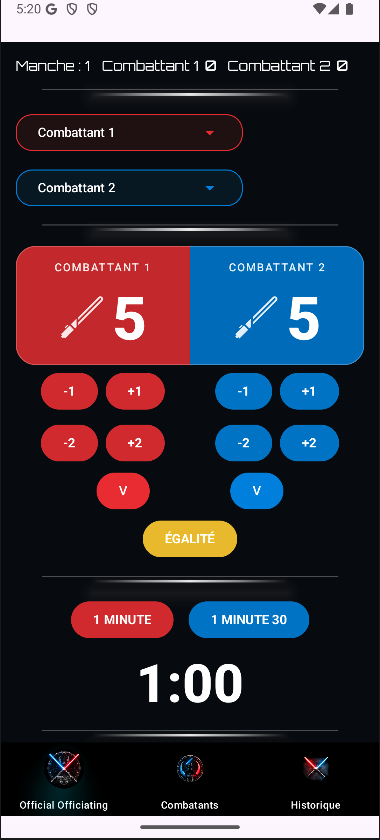

### Arbitrage — combat en cours
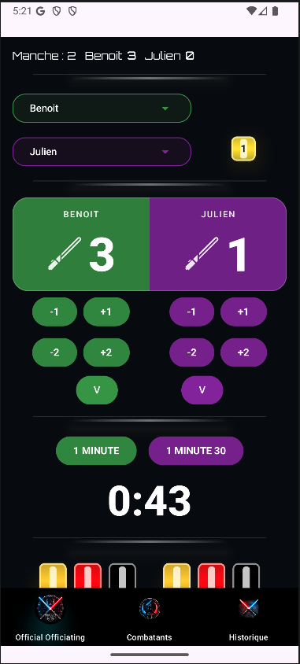

### Arbitrage — combat avec pénalité
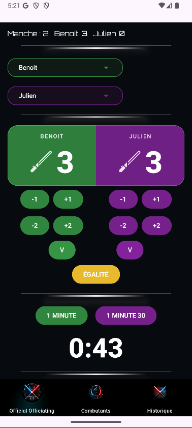

### Ajout d’un combattant
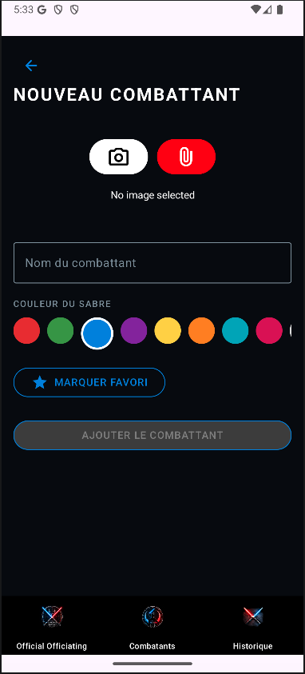

### Liste des combattants
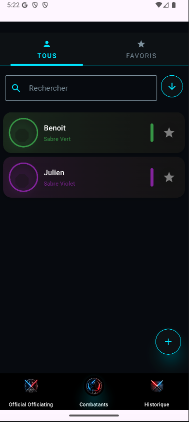

### Profil d’un combattant
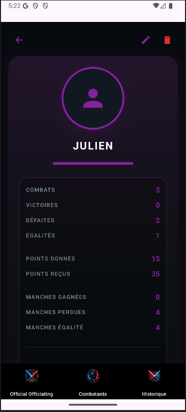

### Statistiques avancées d’un combattant
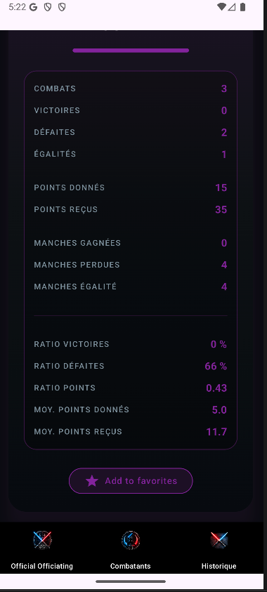

### Historique des combats
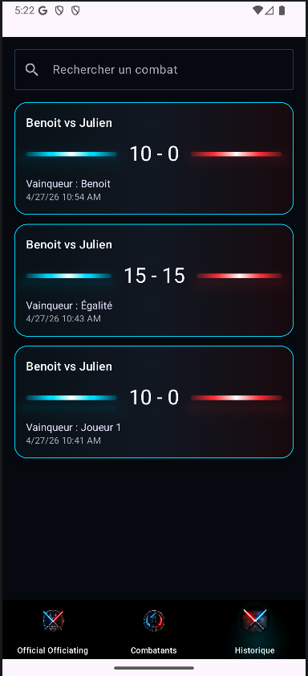

### Historique des combats — autre état
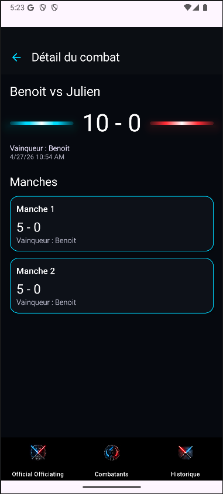

### Écran de pénalité jaune
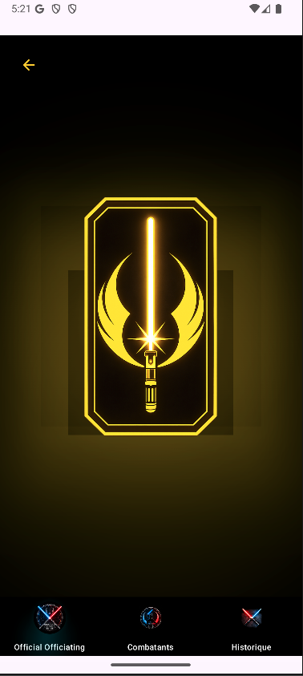

### Fin de combat
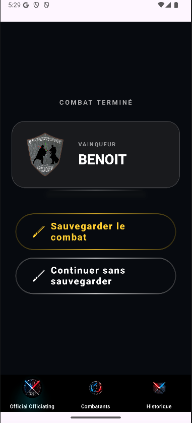

## Architecture

L’application est structurée selon une approche inspirée de la Clean Architecture, avec une séparation claire entre les responsabilités métier, données et interface utilisateur.

L’objectif est de garder une base de code maintenable, testable et évolutive.

- **Data layer** : persistance locale avec Room, DAO, entités et repositories
- **Domain layer** : modèles métier, règles d’arbitrage, mappers et use cases
- **UI layer** : écrans Jetpack Compose, ViewModels, UiState et composants réutilisables
- **DI layer** : injection de dépendances avec Hilt
- **Utils** : fonctions partagées pour les images, dates, détection tablette/mobile et calculs statistiques

La logique métier importante est encapsulée dans la couche `domain`, notamment la gestion des combats, des manches, des scores, des pénalités et des statistiques.

---

### Data Layer

La couche `data` gère la persistance locale et l’accès aux données.

Elle contient notamment :

- Room Database
- DAO
- Entities
- Repositories
- Interfaces de repositories
- Converters Room

Cette couche permet de découpler la logique métier de l’implémentation concrète de la base de données.

---

### Domain Layer

La couche `domain` contient les modèles métier et la logique centrale de l’application.

Elle regroupe notamment :

- modèles métier :
  - `Warrior`
  - `Match`
  - `ScoreRound`
  - `StatisticFight`
  - `SaberColor`
- règles métier :
  - `ArbitrageRegles`
  - `CartonRules`
  - `ParamsReglesArbitrage`
  - `ScoreManche`
- mappers entre les modèles

Cette couche permet de garder les règles d’arbitrage indépendantes de l’interface utilisateur et de la base de données.

---

### Domain Use Cases

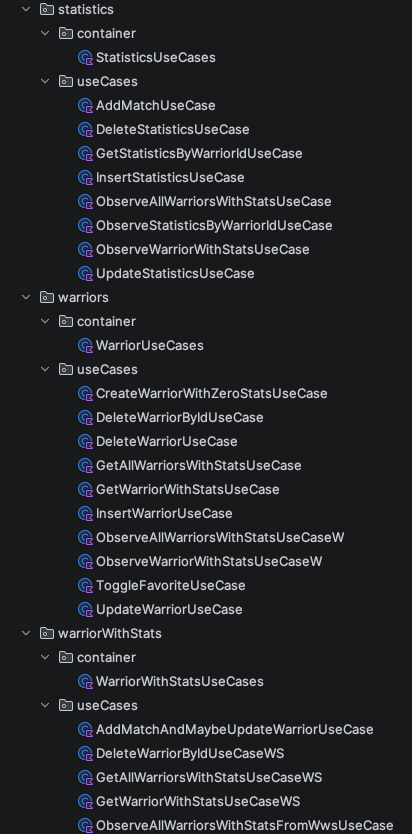

Les use cases sont organisés par domaine fonctionnel :

- gestion des combats
- gestion des combattants
- gestion des statistiques
- gestion des combattants avec statistiques
- observation des données via Flow
- sauvegarde, mise à jour et suppression

Des containers de use cases permettent de simplifier l’injection et de regrouper les actions métier liées à une même fonctionnalité.

Exemples :

- `MatchHistoryUseCases`
- `WarriorUseCases`
- `StatisticsUseCases`
- `WarriorWithStatsUseCases`

---

### UI Layer — Screens et Utils

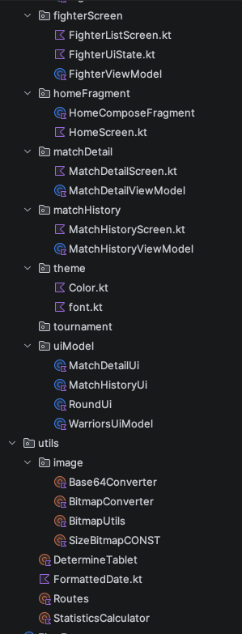

La couche UI est organisée par écran et par fonctionnalité.

Elle contient notamment :

- écrans Compose
- ViewModels
- UiState
- modèles UI
- navigation
- thème graphique
- fonctions utilitaires partagées

Chaque écran possède une responsabilité claire avec son propre état d’interface.

Exemples :

- `FighterListScreen`
- `FighterDetailScreen`
- `MatchHistoryScreen`
- `MatchDetailScreen`
- `HomeScreen`

---

### UI Layer — Composants et écrans

L’interface est construite avec Jetpack Compose et découpée en composants réutilisables.

On retrouve notamment :

- écrans d’arbitrage
- écrans de combat
- écrans de cartons
- ajout de combattant
- détail combattant
- composants de score
- boutons d’action
- sélecteurs de combattants
- timer
- affichage du vainqueur

Cette organisation évite de concentrer toute la logique visuelle dans un seul écran Compose.

---

### UI Components

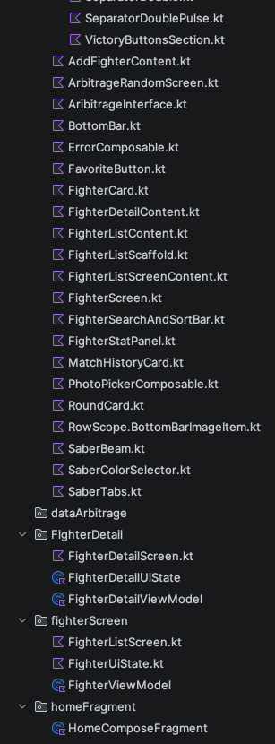

Les composants Compose sont séparés pour améliorer la lisibilité et la réutilisation.

Exemples :

- `CombatScreenContent`
- `CombatHeader`
- `CombatTimerSection`
- `FighterDropdown`
- `FighterSelectorsSection`
- `CartonCounterIcon`
- `VictoryButtonsSection`
- `SaberBeam`
- `SaberColorSelector`
- `BottomBar`

Cette approche permet de construire une interface riche tout en gardant des fichiers plus simples à maintenir.

---

### Core / Utils

Le projet contient aussi des outils partagés utilisés à plusieurs endroits de l’application :

- conversion Bitmap vers Base64
- conversion Base64 vers Bitmap
- gestion des images combattants
- formatage des dates
- détection tablette / mobile
- calculs statistiques
- routes de navigation

---

## Points techniques

- Application conçue pour un usage réel
- Gestion d’état complexe en temps réel
- Composants UI dynamiques
- Encapsulation de la logique métier
- Architecture modulaire facilitant la maintenabilité

---

## Évolution

Application initialement développée en XML puis migrée vers Jetpack Compose.

---

## Note

Le code source complet n’est pas public car utilisé dans un cadre réel.

Ce dépôt présente l’architecture et les fonctionnalités développées.
